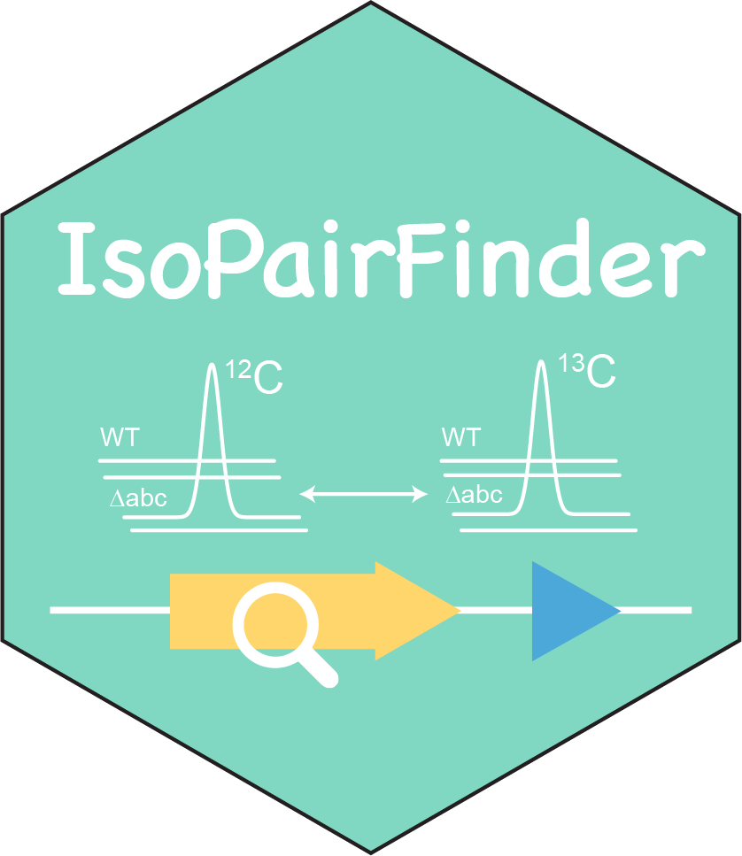

# IsoPairFinder 


[](https://cran.r-project.org/package=IsoPairFinder)
[](https://github.com/DoddLab/IsoPairFinder)

<br><br>


## Overview
**IsoPairFinder** is an R package designed to identify the pathway intermediate feature pairs in stable isotope tracing metabolomics studies. By integrating genetic manipulation techniques, it enables researchers to efficiently screen candidate features and prioritize biologically relevant intermediates for validation. It provides the a end-to-end workflow serving this objective, including (1) differential analysis; (2) merging of the redundant LC-MS features (adducts, neutral losses, and in-source fragments); (3) pairing 12C/13C features to determine potential intermediates. It is also compatible with different metabolomics data processing tools. The **Detailed Tutorial** could be found [here](https://doddlab.github.io/IsoPairFinder_Tutorials/). 

We also deployed IsoPairFinder in the [GNPS2 ecosystem](https://gnps2.org/workflowinput?workflowname=isopairspec_nextflow_workflow) with user friendly interface.


## Installation
This workflow is based on R, which requires installing some dependent packages first. 

```r
# intall public packages
if (!require(devtools)){
    install.packages("devtools")
}

if (!require(BiocManager)){
    install.packages("BiocManager")
}

# Required packages
required_pkgs <- c("dplyr","tidyr","readr", "stringr", "tibble", "purrr",
                   "ggplot2", "igraph", "pbapply", "Rdisop", "randomForest", "pryr", 
                   "magrittr", "rmarkdown", "caret", "writexl", "ggrepel", "crayon", 
                   "data.table", "mzR", "Rdisop", "grid", "gridExtra", "RaMS", "knitr",
                   "rcdk")
BiocManager::install(required_pkgs)
devtools::install_github("JustinZZW/SpectraTools2")
devtools::install_github("DoddLab/MassToolsMjhelf")

# install.packages("IsoPairFinder")
devtools::install_github("DoddLab/IsoPairFinder")
```

## Usage
This is a basic example of HyuA mutants to get you started. The Study design could be found [here](https://doddlab.github.io/IsoPairFinder_Tutorials/caseStudy.html).  

The Demo data could be downloaded [here](https://github.com/DoddLab/IsoPairFinder_demo_data). Briefly, the files contains:

- `peak_table_C12.csv`: the peak area table of unlabeled group (WT and HyuA mutants fed with uric acid)
- `peak_table_C13.csv`: the peak area table of labeled group (WT and HyuA mutants fed with 13C-uric acid)
- `sample_info.csv`: the sample information file, which contains the sample names, groups, and other metadata. 
- `WT_12C`: the folder contains raw data of unlabeled WT (mzML). In demo case, it is "WT_12C" for WT unlabeled group.
  - The rule of folder name is "group_tracer_group". The "group" and "tracer_group" should be consistent with `group` and `tracer_group` columns in the `sample_info.csv` files. 
  - The mzML file names should be included in the `sample_info.csv` file. 
- `hyuA_12C`: the folder contains raw data of unlabeled mutation (mzML). In demo case, it is "hyuA_12C" for HyuA unlabeled group.
  - The rule of folder name is "group_tracer_group". The "group" and "tracer_group" should be consistent with `group` and `tracer_group` columns in the `sample_info.csv` files. 
  - The mzML file names should be included in the `sample_info.csv` file. 
- `WT_13C`: the folder contains raw data of labeled WT (mzML). In demo case, it is "WT_13C" for WT labeled group.
  - The rule of folder name is "group_tracer_group". The "group" and "tracer_group" should be consistent with `group` and `tracer_group` columns in the `sample_info.csv` files. 
  - The mzML file names should be included in the `sample_info.csv` file. 
- `hyuA_13C`: the folder contains raw data of labeled mutation (mzML). The rule of folder name is "group_tracer_group". In demo case, it is "hyuA_13C" for HyuA labeled group.
  - The rule of folder name is "group_tracer_group". The "group" and "tracer_group" should be consistent with `group` and `tracer_group` columns in the `sample_info.csv` files. 
  - The mzML file names should be included in the `sample_info.csv` file. 
- `ms2`: the folder includes MS/MS files (mzML)


```r
library(tidyverse)
library(IsoPairFinder)

# analysis of HyuA 
find_intemidates(peak_table_unlabel = 'peak_table_C12.csv',
                 peak_table_label = 'peak_table_C13.csv',
                 sample_info = 'sample_info.csv',
                 path = '~/Project/00_Uric_Acid_project/Data/20250606_isopairfind_test/Demo_data_msdial/',
                 polarity = 'positive',
                 control_group = c("WT"),
                 case_group = c('hyuA'),
                 mz_tol = 10,
                 rt_tol = 0.05,
                 p_value_cutoff = 0.05,
                 p_adjust = TRUE,
                 fold_change_cutoff = 20,
                 is_recognize_adducts = TRUE)

```

## Availability
| Access Method    | Type | Link |
|:------------------ |:------------------|:---------|
| R Package        | Command line tools | [Link](https://github.com/DoddLab/IsoPairFinder) |
| Web Server       | Graphic interface workflow within GNPS2 ecosystem | [Link](https://gnps2.org/workflowinput?workflowname=isopairspec_nextflow_workflow) |


## Citation
If you use `IsoPairFinder` in your research, please consider citing it. 

- Zhiwei Zhou, Dylan Dodd*, IsoPairFinder: A tool for biochemical pathway discovery using stable isotope tracing metabolomics, In preparation, 2025


## Contact
For questions or issues, please open an issue on GitHub or contact Zhiwei Zhou (zhouzw@stanford.edu).


## License
<a rel="license" href="https://creativecommons.org/licenses/by-nc-nd/4.0/"></a> 
This work is licensed under the Attribution-NonCommercial-NoDerivatives 4.0 International (CC BY-NC-ND 4.0)


